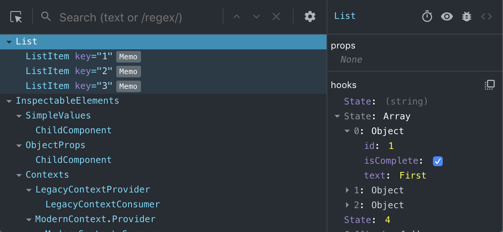

Nous sommes ravis d’annoncer la sortie des nouveaux outils de développement *(DevTools)* React, disponibles dès aujourd’hui dans Chrome, Firefox et Edge (Chromium) !

## Quoi de neuf ? {#whats-changed}

La version 4 change beaucoup de choses !  D’une façon générale, cette nouvelle version devrait améliorer considérablement les performances et l’expérience de navigation.  Elle prend également pleinement en charge les Hooks, y compris l’inspection d’objets imbriqués.



[Allez voir le didacticiel interactif](https://react-devtools-tutorial.now.sh/) pour essayer la nouvelle version ou [consultez le journal des modifications](https://github.com/facebook/react/blob/master/packages/react-devtools/CHANGELOG.md#400-august-15-2019) pour des vidéos de démonstration et davantage de détails.

## Quelles versions de React sont prises en charge ? {#which-versions-of-react-are-supported}

**`react-dom`**

* `0`-`14.x` : non prises en charge
* `15.x` : prises en charge (sauf la nouvelle fonctionnalité de filtrage des composants)
* `16.x` : prises en charge

**`react-native`**
* `0`-`0.61` : non prises en charge
* `0.62` : sera prise en charge (à la sortie de la 0.62)

## Comment obtenir les nouveaux DevTools ? {#how-do-i-get-the-new-devtools}

Les React DevTools sont fournis sous forme d’extension pour [Chrome](https://chrome.google.com/webstore/detail/react-developer-tools/fmkadmapgofadopljbjfkapdkoienihi?hl=fr) et [Firefox](https://addons.mozilla.org/fr/firefox/addon/react-devtools/).  Si vous avez déjà installé l’extension, elle devrait se mettre à jour automatiquement dans les toutes prochaines heures.

Si vous utilisez une enveloppe autonome (par ex. React Native ou Safari), vous pouvez installer la nouvelle version [depuis NPM](https://www.npmjs.com/package/react-devtools) :

```shell
npm install -g react-devtools@^4
```

## Où sont passés tous les éléments du DOM ? {#where-did-all-of-the-dom-elements-go}

Les nouveaux React DevTools fournissent un mécanisme de filtrage des composants de l’arbre afin de faciliter la navigation de hiérarchies profondes.  Les nœuds hôtes (par ex. `<div>` en HTML ou `<View>` en React Native) sont **masqués par défaut**, mais ce filtre peut être désactivé :


## Comment récupérer la version précédente ? {#how-do-i-get-the-old-version-back}

Si vous utilisez React Native en version 60 (ou antérieure) vous pouvez installer la version précédente des DevTools depuis NPM :

```shell
npm install --dev react-devtools@^3
```

Pour les versions plus anciennes de React DOM (v0.14 ou antérieure) il vous faudra recompiler l’extension depuis son code source :

```shell
# Récupérer le source de l’extension
git clone https://github.com/facebook/react-devtools

cd react-devtools

# Se placer sur la branche de la version précédente
git checkout v3

# Installer les dépendances et construire l’extension brute
yarn install
yarn build:extension

# Suivre les instructions à l’écran pour finaliser l’installation
```

## Merci ! {#thank-you}

Nous aimerions remercier toutes les personnes qui ont testé des versions préliminaires des DevTools version 4.  Vos retours nous ont beaucoup aidés à améliorer cette sortie officielle.

Nous avons encore de nombreuses super fonctionnalités en prévision et vos retours sont toujours les bienvenus ! N’hésitez pas à ouvrir un [ticket sur GitHub](https://github.com/facebook/react/issues/new?labels=Component:%20Developer%20Tools) ou à apostropher l’équipe [@reactjs sur Twitter](https://twitter.com/reactjs).
