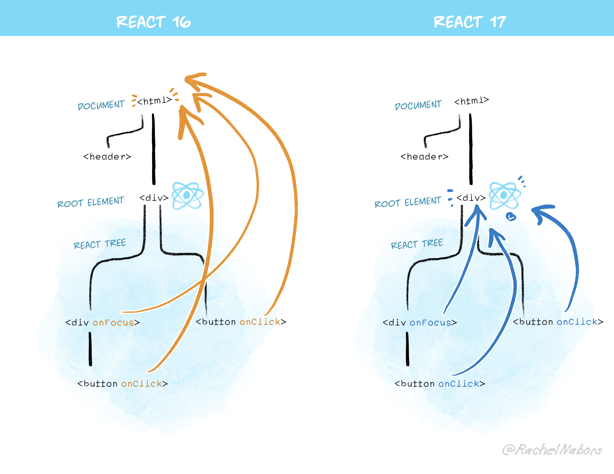

Nous publions aujourd’hui la première *Release Candidate* de React 17.  Déjà 2 ans et demi se sont écoulés depuis [la précédente version majeure de React](/blog/2017/09/26/react-v16.0.html), ce qui fait long, même pour nous !  Dans ce billet de blog, nous allons décrire le rôle de cette version majeure, les changements que vous pouvez en attendre, et la façon de l’essayer.

## Pas de nouvelles fonctionnalités {#no-new-features}

La version 17 de React est inhabituelle en ce qu’elle n’ajoute pas de fonctionnalités à destination des développeur·se·s.  Elle se concentre plutôt sur **la simplification des mises à jour de React-même.**

Nous travaillons activement sur les nouvelles fonctionnalités de React, mais elle ne figurent pas dans cette version.  La version 17 de React est au cœur de notre stratégie visant à sortir de nouvelles versions que tous nos utilisateurs pourront adopter facilement.

Pour être plus précis, **React 17 est une version « passerelle »** qui fiabilise l’intégration, au sein d’un arbre de composants géré par une version de React, d’un arbre géré par une version différente.

## Mises à jour graduelles {#gradual-upgrades}

Depuis 7 ans, les mises à jour de React ont toujours été « tout-ou-rien ».  Soit vous restiez sur une ancienne version, soit vous mettiez à jour toute votre application.  Il n’y avait pas de troisième voie.

Ça a fonctionné jusqu’ici, mais on commence à sentir les limites de cette stratégie de mise à jour « tout-ou-rien ».  Certaines évolutions de l’API, telles que la dépréciation de [l’API historique des Contextes](/docs/legacy-context.html), ne peuvent être réalisées de façon automatique.  Même si la plupart des applis écrites aujourd’hui ne s’en servent jamais, nous devons continuer à les prendre en charge dans React.  Il nous faut alors choisir entre continuer indéfiniment ou condamner certaines applis à rester sur une version ancienne de React : un dilemme désagréable.

Nous avons donc voulu proposer un autre chemin.

**React 17 permet des mises à jour graduelles de React.** Lorsque vous avez migré de React 15 à 16 (et bientôt de React 16 à 17), vous avez normalement dû migrer toute votre appli d’un bloc.  Ça fonctionne bien pour de nombreuses applis.  Mais ça devient de plus en plus délicat  lorsque la base de code date de plusieurs années et n’est pas activement maintenue.  Même s’il reste possible d’utiliser deux versions de React sur une même page, jusqu’à React 17 c’était un exercice périlleux et pouvait poser des problèmes liés à la gestion des événements.

Nous réglons la majorité de ces soucis avec React 17. Ça signifie que **lorsque React 18 et les versions ultérieures sortiront, vous aurez désormais davantage d’options**. La première sera de mettre à jour votre appli entière d’un bloc, comme vous le faisiez jusqu’ici.  Mais vous pourrez aussi choisir de la mettre à jour par étapes.  Par exemple, vous pourriez décider de migrer l’essentiel vers React 18, mais de garder une boîte de dialogue ou une sous-route sur React 17.

Vous ne **devez** pas pour autant procéder de façon graduelle.  Dans la plupart des cas, une mise à jour intégrale restera la meilleure solution.  Charger deux versions de React—quand bien même l’une serait chargée paresseusement—n’est toujours pas idéal.  Ceci dit, pour de grosses applis qui ne sont pas activement maintenues, cette option pourrait être pertinente, et React 17 permet à de telles applis de ne pas être coincées avec de vieilles versions.

Afin de permettre ces mises à jour graduelles, nous avons dû modifier certaines choses dans le système de gestion des événements de React.  React 17 est une version majeure car certains de ces changements peuvent casser la compatibilité ascendante.  En pratique, nous n’avons eu qu’une vingtaine de composants à ajuster (sur plus de 100 000), aussi **nous estimons que la large majorité des applis pourront migrer vers React 17 sans trop de difficultés**. Si vous rencontrez des obstacles, [dites-le-nous](https://github.com/facebook/react/issues).

### Démo de mises à jour graduelles {#demo-of-gradual-upgrades}

Nous avons préparé un [dépôt d’exemple](https://github.com/reactjs/react-gradual-upgrade-demo/) illustrant la façon de charger paresseusement une ancienne version de React si nécessaire.  Cette démo utilise Create React App, mais vous pouvez suivre une approche similaire quel que soit l’outil.  Nous accepterons avec joie des démos basées sur d’autres outils que vous nous enverriez au travers de *pull requests*.

> Remarque
>
> Nous avons **différé les autres modifications** pour après React 17.  L’objectif de cette version est de permettre les mises à jour graduelles.  Si adopter React 17 était trop lourd, ça nuirait à cette ambition.

## Modifications de la délégation d’événements {#changes-to-event-delegation}

Techniquement, il a toujours été possible d’imbriquer des applis développées avec des versions différentes de React.  Toutefois, le résultat était plutôt fragile en raison du système d’événements de React.

Dans des composants React, vous définissez habituellement des gestionnaires d’événements en ligne sous forme de _props_ :

```js
<button onClick={handleClick}>
```

L’équivalent du code ci-dessus en DOM natif ressemblerait à ceci :

```js
myButton.addEventListener('click', handleClick);
```

Cependant, pour la plupart des événements, React n’attache pas réellement les gestionnaires aux nœuds DOM sur lesquels vous les déclarez.  Au lieu de ça, React attache un gestionnaire par événement directement sur le nœud `document`.  Ça s’appelle de la [délégation d’événements](https://davidwalsh.name/event-delegate). Non seulement ça améliore la performance des gros arbres applicatifs, mais ça facilite en prime l’ajout de fonctionnalités telles que [rejouer les événements](https://twitter.com/dan_abramov/status/1200118229697486849).

React recourt automatiquement à la délégation d’événements depuis sa première version.  Quand un événement DOM est déclenché sur le document, React retrouve le composant à appeler, après quoi l’événement React « bouillonne » vers le haut de l’arbre, en passant au travers des composants parents.  Mais en coulisses, l’événement natif a déjà bouillonné jusqu’au niveau de `document`, où sont installés les gestionnaires d’événements de React.

Ça présente un souci pour les mises à jour graduelles.

Si vous avez de multiples versions de React sur la page, elles inscrivent toutes leurs gestionnaires d‘événements à la racine.  Ça enfreint la sémantique de `e.stopPropagation()` : si un arbre imbriqué a stoppé la propagation d’un événement, l’arbre conteneur le recevrait tout de même.  Il est donc périlleux d’imbriquer des versions distinctes de React.  Ce cas de figure n’a rien de théorique : l’éditeur Atom, par exemple, [a buté dessus](https://github.com/facebook/react/pull/8117) il y a déjà quatre ans.

Voilà pourquoi nous changeons la façon dont React, en coulisses, attache les événements aux nœuds du DOM.

**Dans React 17, React n’attachera plus les gestionnaires d’événements au niveau de `document`.  Au lieu de ça, il les attachera au conteneur DOM racine au sein duquel votre arbre React fait son rendu :**

```js
const rootNode = document.getElementById('root');
ReactDOM.render(<App />, rootNode);
```

Jusqu’à React 16 inclus, React aurait fait un `document.addEventListener()` pour la plupart des événements.  À compter de React 17, il appellera plutôt `rootNode.addEventListener()` sous le capot.



Grâce à ce changement, **il est désormais plus fiable d’imbriquer un arbre React géré par une version donnée dans un arbre géré par une version différente de React**.  Remarquez que pour que ça fonctionne, les deux versions doivent être 17 ou ultérieure, raison pour laquelle il est vital de mettre à jour vers React 17.  En un sens, React 17 est une version « passerelle » qui rend possible les mises à jour graduelles ultérieures.

Cette modification **facilite aussi l’imbrication de React dans des applis construites avec d’autres technologies**. Par exemple, si la « coquille » extérieure de votre appli était écrite avec jQuery, mais que le code plus récent à l’intérieur était écrit avec React, `e.stopPropagation()` au sein du code React l’empêcherait désormais d’atteindre le code jQuery—exactement comme vous êtes en droit de l’attendre.  Ça marche aussi dans l’autre sens.  Si vous n’aimez plus React et voulez réécrire votre appli (par exemple, avec jQuery) vous pouvez commencer à convertir le bloc externe vers jQuery sans casser la propagation des événements.

Nous avons pu vérifier que de [nombreux](https://github.com/facebook/react/issues/7094) [problèmes](https://github.com/facebook/react/issues/8693) [signalés](https://github.com/facebook/react/issues/12518) [au](https://github.com/facebook/react/issues/13451) [fil](https://github.com/facebook/react/issues/4335) [du](https://github.com/facebook/react/issues/1691) [temps](https://github.com/facebook/react/issues/285#issuecomment-253502585) [sur notre](https://github.com/facebook/react/pull/8117) [suivi](https://github.com/facebook/react/issues/11530) [de bugs](https://github.com/facebook/react/issues/7128), liés à l’intégration de React avec du code non React, ont bien été réglés avec ce nouveau comportement.

> Remarque
>
> Vous vous demandez peut-être si ça casse les [portails](/docs/portals.html) situés hors du conteneur racine applicatif.  Dans la mesure où React écoute *aussi* les événements des conteneurs de portails, ça ne pose aucun problème.

#### Corriger les problèmes éventuels {#fixing-potential-issues}

Comme avec n’importe quelle rupture de la compatibilité ascendante, vous aurez sans doute besoin d’ajuster du code ici ou là.  Chez Facebook, nous avons dû ajuster environ 10 modules au total (sur plusieurs milliers) pour que tout remarche.

Par exemple, si vous ajoutez manuellement des écouteurs DOM avec `document.addEventListener(...)`, vous vous attendez peut-être à y retrouver tous les événements React.  Jusqu’à React 16 inclus, même si vous appeliez `e.stopPropagation()` dans un gestionnaire d’événement React, vos écouteurs manuels sur `document` les recevaient tout de même, puisque l’événement natif sous-jacent était *déjà* au niveau du document. À partir de React 17, la propagation *cesserait* (comme demandé !), du coup vos gestionnaires `document` ne seraient pas déclenchés :

```js
document.addEventListener('click', function() {
  // Ce gestionnaire manuel ne recevra plus les clics issus
  // de composants React qui appelleraient e.stopPropagation()
});
```

Vous pouvez corriger ce type de code en convertissant votre écouteur pour utiliser la [phase de capture](https://javascript.info/bubbling-and-capturing#capturing). Pour cela, ajoutez `{ capture: true }` en troisième argument de `document.addEventListener` :

```js
document.addEventListener('click', function() {
  // À présent ce gestionnaire d’événement utilise la phase
  // de capture, il recevra donc *tous* les événements de clic
  // en-dessous de son niveau !
}, { capture: true });
```

Remarquez que cette approche est plus robuste de façon générale ; par exemple, elle corrigera sans doute des bugs existants dans votre code qui survenaient lorsque `e.stopPropagation()` était appelé hors d’un gestionnaire d’événement React.  En d’autres termes, **la propagation des événements dans React 17 sera plus conforme à celle du DOM lui-même**.

## Autres ruptures de compatibilité {#other-breaking-changes}

Nous avons limité au maximum les ruptures de compatibilité ascendante dans React 17.  Par exemple, nous n’y retirons pas les méthodes marquées comme dépréciées dans de précédentes versions.  Toutefois, il y reste quelques ruptures que, d’après notre expérience, nous avons jugées relativement bénignes.  Au total nous n’avons eu à ajuster, pour les prendre en compte, qu’une vingtaine de nos plus de 100 000 composants.

### S’aligner sur les navigateurs {#aligning-with-browsers}

Nous avons apporté quelques ajustements mineurs au système de gestion d’événements :

* L’événement `onScroll` **ne bouillonne plus** afin d’éviter un comportement [fréquemment déroutant](https://github.com/facebook/react/issues/15723).
* Les événements React `onFocus` et `onBlur` utilisent désormais sous le capot les événements natifs `focusin` et `focusout`, qui correspondent davantage au comportement existant de React et fournissent parfois davantage d’informations.
* Les événements en phase de capture (ex. `onClickCapture`) utilisent désormais des écouteurs natifs exploitant réellement la phase de capture.

Ces changements alignent davantage React sur le comportement natif du navigateur et améliorent l’interopérabilité.

> Remarque
>
> Même si React 17 est passé de `focus` à `focusin` *sous le capot* pour l’événement `onFocus`, remarquez que ça n’a **pas** affecté le comportement de bouillonnement.  Dans React, l’événement `onFocus` a toujours bouillonné et continuera à le faire dans React 17 car c’est un comportement par défaut généralement plus utile.  Voyez [ce bac à sable](https://codesandbox.io/s/strange-albattani-7tqr7?file=/src/App.js) pour explorer les diverses vérifications que vous pouvez ajouter selon votre cas d’utilisation.

### La fin du recyclage d’événements {#no-event-pooling}

React 17 met un terme à l’optimisation de « recyclage d’événements » employée jusqu’ici.  Celle-ci n’améliore en fait pas les performances sur les navigateurs modernes, mais peut s’avérer déroutante même pour les utilisateur·rice·s expérimenté·e·s de React :

```js
function handleChange(e) {
  setData(data => ({
    ...data,
    // Ça va planter jusqu’à React 16 inclus :
    text: e.target.value
  }));
}
```

Le souci vient ici du fait que React réutilisait les objets événements d’un événement à l’autre afin d’améliorer la performance sur les vieux navigateurs, et réinitialisait tous les champs de l’événement à `null` entre deux utilisations.  Jusqu’à React 16 inclus, il vous fallait appeler `e.persist()` pour pouvoir continuer à utiliser l’événement, par exemple y lire une propriété définie plus tôt.

**Dans React 17, ce code marchera comme attendu.  La vieille optimisation de recyclage d’événements a été entièrement retirée, de sorte que vous pouvez lire les champs des événements partout où vous le souhaitez.**

Le comportement change, ce qui fait qu’on le signale comme une rupture de compatibilité, mais en pratique ça n’a rien cassé chez Facebook. (Ça a peut-être même corrigé quelques bugs !)  Remarquez que `e.persist()` reste disponible sur l’objet d’événement React, mais elle ne fait plus rien.

### Planification du nettoyage d’effet {#effect-cleanup-timing}

Nous améliorons la cohérence de planification de la fonction de nettoyage de `useEffect`.

```js{3-5}
useEffect(() => {
  // L’effet à proprement parler est ici.
  return () => {
    // Et voici son nettoyage.
  };
});
```

La plupart des effets n’ont pas besoin de différer les mises à jour de rendu, de sorte que React les exécute de façon asynchrone peu après avoir reflété la mise à jour à l’écran.  (Dans les rares cas où vous avez besoin qu’un effet suspende l’affichage, par exemple pour mesurer et positionner une infobulle, préférez `useLayoutEffect`.)

Ceci dit, le fonction de *nettoyage* de l’effet, lorsqu’elle existe, s’exécutait de façon synchrone en React 16.  Nous avons pu constater que, comme pour la méthode synchrone `componentWillUnmount` sur les composants à base de classes, c’était loin d’être idéal pour les applis d’une certaine taille, car ça ralentissait les transitions entre écrans massifs (ex. bascule entre onglets).

**Dans React 17, la fonction de nettoyage d’effet s’exécute elle aussi de façon asynchrone ; par exemple, si le composant est en cours de démontage, le nettoyage aura lieu _après_ que l’écran aura été mis à jour.**

Ça reflète mieux la façon dont les effets eux-mêmes sont exécutés.  Dans les rares cas où vous souhaiteriez dépendre d’une exécution synchrone, vous pouvez utiliser plutôt `useLayoutEffect`.

> Remarque
>
> Vous vous demandez peut-être si ça signifie que vous ne pourrez plus corriger les avertissements relatifs à `setState` sur les composants démontés.  Ne vous inquiétez pas : React vérifie spécifiquement ce cas de figure, et *ne déclenche pas* les avertissements relatifs à `setState` dans le bref intervalle entre le démontage et le nettoyage.  **Ainsi le code de nettoyage annulant les requêtes réseau ou horloges périodiques pourra presque toujours rester inchangé.**

Qui plus est, React 17 exécute les fonctions de nettoyage dans le même ordre que leurs effets, en fonction de leur position dans l’arbre.  Auparavant, cet ordre pouvait parfois différer.

#### Problèmes potentiels {#potential-issues}

Ce changement n’a cassé que quelques-uns de nos composants, même si les bibliothèques réutilisables auront peut-être besoin de tester son impact de façon plus poussée.  Un exemple de code problématique pourrait ressembler à ceci :

```js
useEffect(() => {
  someRef.current.someSetupMethod();
  return () => {
    someRef.current.someCleanupMethod();
  };
});
```

Le souci vient du fait que `someRef.current` est modifiable, de sorte qu’avant que la fonction de nettoyage soit exécutée, il risque d’avoir été mis à `null`.  La solution consisterait à capturer toute valeur pertinente modifiable *au sein* de l’effet :

```js
useEffect(() => {
  const instance = someRef.current;
  instance.someSetupMethod();
  return () => {
    instance.someCleanupMethod();
  };
});
```

Nous n’anticipons pas de gros problèmes de ce type parce que [notre règle d’analyse statique `eslint-plugin-react-hooks/exhaustive-deps`](https://github.com/facebook/react/tree/master/packages/eslint-plugin-react-hooks) (assurez-vous de l’utiliser !) a toujours averti de ce type de scénario.

### Des erreurs plus cohérentes lorsqu’on renvoie `undefined` {#consistent-errors-for-returning-undefined}

Jusqu’à React 16 inclus, renvoyer `undefined` a toujours produit une erreur :

```js
function Button() {
  return; // Erreur : `render` n’a rien renvoyé
}
```

C’est en partie parce qu’il est facile de renvoyer `undefined` par accident :

```js
function Button() {
  // On a oublié d’écrire un `return`, du coup ce composant renvoie `undefined`.
  // React en fait une erreur plutôt que de passer ça sous silence.
  <button />;
}
```

Jusqu’ici, React procédait ainsi pour les composants à base de classes et les fonctions composants, mais ne vérifiait pas les valeurs renvoyées par les composants produits par `forwardRef` et `memo`.  C’était dû à une erreur dans son code.

**Dans React 17, le comportement des composants produits par `forwardRef` et `memo` est cohérent avec celui des fonctions composants et composants à base de classe. Renvoyer `undefined` y constituera une erreur.**

```js
let Button = forwardRef(() => {
  // On a oublié d’écrire un `return`, du coup ce composant renvoie `undefined`.
  // React 17 en fait une erreur plutôt que de passer ça sous silence.
  <button />;
});

let Button = memo(() => {
  // On a oublié d’écrire un `return`, du coup ce composant renvoie `undefined`.
  // React 17 en fait une erreur plutôt que de passer ça sous silence.
  <button />;
});
```

Dans les cas où vous souhaitez intentionnellement ne rien renvoyer, renvoyez plutôt `null`.

### Piles de composants natives {#native-component-stacks}

Lorsque vous levez une erreur dans le navigateur, celui-ci vous donne une trace de pile _(stack trace, NdT)_ avec des noms et emplacements de fonctions JavaScript.  Seulement voilà, ces traces de piles sont souvent insuffisantes pour diagnostiquer le problème, parce que la hiérarchie de l’arbre React est tout aussi importante.  Vous voulez savoir non seulement qu’un `Button` a levé une erreur, mais *où ce `Button` figure dans l’arbre React*.

Pour remédier à ça, React 16 a commencé à afficher des « piles de composants » lorsque vous rencontrez une erreur.  Celles-ci n’avaient toutefois pas tous les avantages des traces de piles JavaScript natives.  En particulier, vous ne pouviez pas cliquer dessus dans la console parce que React ne savait pas où la fonction était déclarée dans votre code source.  Qui plus est, elles étaient [globalement inexploitables en production](https://github.com/facebook/react/issues/12757).  Contrairement aux traces de piles du JavaScript minifié, qui peuvent automatiquement être transformées vers leurs noms et positions natives grâce à une _sourcemap_, les piles de composants React nous forçaient à choisir entre avoir des piles en production ou améliorer la taille de nos _bundles_.

**Dans React 17, les piles de composants sont générées par un mécanisme différent qui les agrège aux traces de piles JavaScript natives.  Vous pouvez ainsi bénéficier de traces de piles avec composants React pleinement descriptives, même dans un environnement de production.**

Pour y parvenir, React suit une approche assez inorthodoxe.  Les navigateurs ne fournissent pas pour le moment un moyen de récupérer le cadre de pile d’une fonction (dont son fichier source et sa position à l’intérieur).  Aussi, lorsque React détecte une erreur, il va désormais *reconstruire* sa pile de composants en levant (et rattrapant) une erreur temporaire au sein de chaque composant ancêtre, lorsque c’est possible.  Ça dégrade très légèrement la performance des erreurs, mais ça n’arrive qu’une fois par type de composant.

Si vous êtes curieux·se, vous pouvez en apprendre davantage dans [cette _pull request_](https://github.com/facebook/react/pull/18561), mais pour l’essentiel le détail du mécanisme ne devrait en rien affecter votre code.  De votre point de vue, la nouveauté vient de ce que les piles de composants sont désormais cliquables (puisqu’elles se reposent sur les traces de piles natives du navigateur), et que vous pouvez les décoder en production comme pour n’importe quelle erreur JavaScript classique.

On rompt ici la compatibilité ascendante parce que, pour que ça fonctionne, React doit ré-exécuter une partie de certaines des fonctions composants (et des constructeurs de composants à base de classe) plus haut dans la pile après qu’une erreur est survenue.  Dans la mesure où les fonctions de rendu et les constructeurs de classes ne devraient pas contenir d’effets de bord (un point important pour le rendu côté serveur également), ça ne devrait pas poser de problème en pratique.

### Retrait des exports privés {#removing-private-exports}

Pour finir, la dernière rupture notable de compatibilité ascendante vient de ce que nous avons retiré quelques éléments internes de React qui étaient jusqu’ici accessibles par du code tiers.  En particulier, [React Native for Web](https://github.com/necolas/react-native-web) dépendait de certains éléments internes du système de gestion d’événements, mais ce couplage était fragile et avait tendance à planter.

**Dans React 17, ces exports privés ont été retirés.  Pour autant qu’on sache, React Native for Web était le seul projet qui s’en servait, et ils ont déjà migré vers une approche qui ne repose plus dessus.**

Ça signifie que les anciennes versions de React Native for Web ne seront pas compatibles avec React 17, mais les versions plus récentes fonctionneront très bien.  En pratique, ça ne change pas grand-chose parce que React Native for Web avait de toutes façons besoin de sortir de nouvelles versions pour s’adapter aux modifications internes de React.

Qui plus est, nous avons retiré les méthodes utilitaires `ReactTestUtils.SimulateNative`.  Elles n’avaient jamais été documentées, ne faisaient pas tout à fait ce que leur nom laissait entendre, et ne fonctionnaient plus suite aux évolutions récentes du système de gestion d’événements.  Si vous cherchez un moyen pratique de déclencher des événements natifs du navigateur dans vos tests, jetez plutôt un coup d’œil à [React Testing Library](https://testing-library.com/docs/dom-testing-library/api-events).

## Installation {#installation}

Nous vous encourageons à essayer dès que vous le pourrez React 17.0 Release Candidate et à [nous faire part de tout problème](https://github.com/facebook/react/issues) que vous pourriez rencontrer pendant votre migration. **Gardez à l’esprit qu’une version _release candidate_ est plus susceptible de contenir des bugs qu’une version stable, aussi ne la déployez pas en production pour le moment.**

Pour installer React 17 RC avec npm, exécutez :

```bash
npm install react@17.0.0-rc.1 react-dom@17.0.0-rc.1
```

Pour installer React 17 RC avec Yarn, exécutez :

```bash
yarn add react@17.0.0-rc.1 react-dom@17.0.0-rc.1
```

Nous fournissons aussi des builds UMD de React via un CDN :

```html
<script crossorigin src="https://unpkg.com/react@17.0.0-rc.1/umd/react.production.min.js"></script>
<script crossorigin src="https://unpkg.com/react-dom@17.0.0-rc.1/umd/react-dom.production.min.js"></script>
```

Référez-vous à la documentation pour des [instructions détaillées d’installation](/docs/installation.html).

## Changelog {#changelog}

### React {#react}

* Ajoute `react/jsx-runtime` et `react/jsx-dev-runtime` pour la [nouvelle transformation JSX](https://babeljs.io/blog/2020/03/16/7.9.0#a-new-jsx-transform-11154-https-githubcom-babel-babel-pull-11154). ([@lunaruan](https://github.com/lunaruan) dans [#18299](https://github.com/facebook/react/pull/18299))
* Construit des piles de composants à partir des traces de piles natives. ([@sebmarkbage](https://github.com/sebmarkbage) dans [#18561](https://github.com/facebook/react/pull/18561))
* Permet de préciser `displayName` dans le contexte pour des piles améliorées. ([@eps1lon](https://github.com/eps1lon) dans [#18224](https://github.com/facebook/react/pull/18224))
* Évite les fuites de `'use strict'` dans les bundles UMD. ([@koba04](https://github.com/koba04) dans [#19614](https://github.com/facebook/react/pull/19614))
* Cesse d‘utiliser `fb.me` pour les redirections. ([@cylim](https://github.com/cylim) dans [#19598](https://github.com/facebook/react/pull/19598))

### React DOM {#react-dom}

* Délègue les événements à la racine plutôt que sur `document`. ([@trueadm](https://github.com/trueadm) dans [#18195](https://github.com/facebook/react/pull/18195) et [d’autres](https://github.com/facebook/react/pulls?q=is%3Apr+author%3Atrueadm+modern+event+is%3Amerged))
* Nettoie tous les effets avant d’exécuter les effets suivants. ([@bvaughn](https://github.com/bvaughn) dans [#17947](https://github.com/facebook/react/pull/17947))
* Exécute les fonctions de nettoyage de `useEffect` de façon asynchrone. ([@bvaughn](https://github.com/bvaughn) dans [#17925](https://github.com/facebook/react/pull/17925))
* Utilise les `focusin` et `focusout` du navigateur pour `onFocus` et `onBlur`. ([@trueadm](https://github.com/trueadm) dans [#19186](https://github.com/facebook/react/pull/19186))
* Exploite la phase de capture du navigateur pour tous les événements `Capture`. ([@trueadm](https://github.com/trueadm) dans [#19221](https://github.com/facebook/react/pull/19221))
* Cesse de simuler le bouillonnement pour l’événement `onScroll`. ([@gaearon](https://github.com/gaearon) dans [#19464](https://github.com/facebook/react/pull/19464))
* Lève une exception si un composant `forwardRef` ou `memo` renvoie `undefined`. ([@gaearon](https://github.com/gaearon) dans [#19550](https://github.com/facebook/react/pull/19550))
* Retire le recyclage des événements. ([@trueadm](https://github.com/trueadm) dans [#18969](https://github.com/facebook/react/pull/18969))
* Cesse d’exposer des éléments internes que React Native for Web n’utilisera plus. ([@necolas](https://github.com/necolas) dans [#18483](https://github.com/facebook/react/pull/18483))
* Attache tous les gestionnaires d’événements connus lors du montage de la racine. ([@gaearon](https://github.com/gaearon) dans [#19659](https://github.com/facebook/react/pull/19659))
* Désactive `console` lors de la seconde passe de rendu du mode DEV. ([@sebmarkbage](https://github.com/sebmarkbage) dans [#18547](https://github.com/facebook/react/pull/18547))
* Déprécie l’API non documentée et déroutante `ReactTestUtils.SimulateNative`. ([@gaearon](https://github.com/gaearon) dans [#13407](https://github.com/facebook/react/pull/13407))
* Renomme les champs privés utilisés par des éléments internes. ([@gaearon](https://github.com/gaearon) dans [#18377](https://github.com/facebook/react/pull/18377))
* Cesse d’appeler l’API User Timing en développement. ([@gaearon](https://github.com/gaearon) dans [#18417](https://github.com/facebook/react/pull/18417))
* Désactive la console lors du rendu répété du mode strict. ([@sebmarkbage](https://github.com/sebmarkbage) dans [#18547](https://github.com/facebook/react/pull/18547))
* En mode strict, fait le double rendu des composants sans les Hooks. ([@eps1lon](https://github.com/eps1lon) dans [#18430](https://github.com/facebook/react/pull/18430))
* Permet l’appel de `ReactDOM.flushSync` au sein des méthodes de cycle de vie (avec avertissement). ([@sebmarkbage](https://github.com/sebmarkbage) dans [#18759](https://github.com/facebook/react/pull/18759))
* Ajoute la propriété `code` sur les objets d’événements clavier. ([@bl00mber](https://github.com/bl00mber) dans [#18287](https://github.com/facebook/react/pull/18287))
* Ajoute la propriété `disableRemotePlayback` aux éléments `video`. ([@tombrowndev](https://github.com/tombrowndev) dans [#18619](https://github.com/facebook/react/pull/18619))
* Ajoute la propriété `enterKeyHint` aux éléments `input`. ([@eps1lon](https://github.com/eps1lon) dans [#18634](https://github.com/facebook/react/pull/18634))
* Avertit de l’absence de `value` sur les `<Context.Provider>`. ([@charlie1404](https://github.com/charlie1404) dans [#19054](https://github.com/facebook/react/pull/19054))
* Avertit lorsque les composants `memo` ou `forwardRef` renvoient `undefined`. ([@bvaughn](https://github.com/bvaughn) dans [#19550](https://github.com/facebook/react/pull/19550))
* Améliore le message d’erreur des mises à jour invalides. ([@JoviDeCroock](https://github.com/JoviDeCroock) dans [#18316](https://github.com/facebook/react/pull/18316))
* Exclut les `forwardRef` et `memo` des traces de piles. ([@sebmarkbage](https://github.com/sebmarkbage) dans [#18559](https://github.com/facebook/react/pull/18559))
* Améliore le message d’erreur lors de la bascule entre champs contrôlés et non contrôlés. ([@vcarl](https://github.com/vcarl) dans [#17070](https://github.com/facebook/react/pull/17070))
* Maintient `onTouchStart`, `onTouchMove`, et `onWheel` passifs. ([@gaearon](https://github.com/gaearon) dans [#19654](https://github.com/facebook/react/pull/19654))
* Corrige le gel de `setState` en développement au sein d’un `<iframe>` fermé. ([@gaearon](https://github.com/gaearon) dans [#19220](https://github.com/facebook/react/pull/19220))
* Corrige l’abandon de rendu des composants paresseux avec `defaultProps`. ([@jddxf](https://github.com/jddxf) dans [#18539](https://github.com/facebook/react/pull/18539))
* Corrige l’avertissement faux positif lorsque `dangerouslySetInnerHTML` est `undefined`. ([@eps1lon](https://github.com/eps1lon) dans [#18676](https://github.com/facebook/react/pull/18676))
* Corrige les utilitaires de tests dotés d’une implémentation non standard de `require`. ([@just-boris](https://github.com/just-boris) dans [#18632](https://github.com/facebook/react/pull/18632))
* Corrige `onBeforeInput` pour ne plus signaler un `event.type` incorrect. ([@eps1lon](https://github.com/eps1lon) dans [#19561](https://github.com/facebook/react/pull/19561))
* Corrige `event.relatedTarget` signalé comme `undefined` dans Firefox. ([@claytercek](https://github.com/claytercek) dans [#19607](https://github.com/facebook/react/pull/19607))
* Corrige "unspecified error" dans IE11. ([@hemakshis](https://github.com/hemakshis) dans [#19664](https://github.com/facebook/react/pull/19664))
* Corrige le rendu dans une racine *shadow*. ([@Jack-Works](https://github.com/Jack-Works) dans [#15894](https://github.com/facebook/react/pull/15894))
* Corrige le polyfill `movementX/Y` avec des événements de capture. ([@gaearon](https://github.com/gaearon) dans [#19672](https://github.com/facebook/react/pull/19672))
* Utilise la délégation pour les événements `onSubmit` et `onReset`. ([@gaearon](https://github.com/gaearon) dans [#19333](https://github.com/facebook/react/pull/19333))
* Améliore l’efficacité mémoire. ([@trueadm](https://github.com/trueadm) dans [#18970](https://github.com/facebook/react/pull/18970))

### React DOM Server {#react-dom-server}

* Homogénéise les comportements de `useCallback` et `useMemo` pour le moteur de rendu côté serveur. ([@alexmckenley](https://github.com/alexmckenley) dans [#18783](https://github.com/facebook/react/pull/18783))
* Corrige la fuite d’état lorsqu’une fonction composant lève une exception. ([@pmaccart](https://github.com/pmaccart) dans [#19212](https://github.com/facebook/react/pull/19212))

### React Test Renderer {#react-test-renderer}

* Améliore le message d’erreur de `findByType`. ([@henryqdineen](https://github.com/henryqdineen) dans [#17439](https://github.com/facebook/react/pull/17439))

### Mode concurrent (expérimental) {#concurrent-mode-experimental}

* Repense les heuristiques d’agrégation de priorités. ([@acdlite](https://github.com/acdlite) dans [#18796](https://github.com/facebook/react/pull/18796))
* Ajoute le préfixe `unstable_` aux API expérimentales. ([@acdlite](https://github.com/acdlite) dans [#18825](https://github.com/facebook/react/pull/18825))
* Retire `unstable_discreteUpdates` et `unstable_flushDiscreteUpdates`. ([@trueadm](https://github.com/trueadm) dans [#18825](https://github.com/facebook/react/pull/18825))
* Retire l’argument `timeoutMs`. ([@acdlite](https://github.com/acdlite) dans [#19703](https://github.com/facebook/react/pull/19703))
* Désactive le prérendu `<div hidden />` au profit d’une future API de remplacement. ([@acdlite](https://github.com/acdlite) dans [#18917](https://github.com/facebook/react/pull/18917))
* Ajoute un Hook expérimental `unstable_useOpaqueIdentifier`. ([@lunaruan](https://github.com/lunaruan) dans [#17322](https://github.com/facebook/react/pull/17322))
* Ajoute l’API expérimentale `unstable_startTransition`. ([@rickhanlonii](https://github.com/rickhanlonii) dans [#19696](https://github.com/facebook/react/pull/19696))
* L’utilisation de `act` dans un moteur de rendu de test ne purge plus les variations de secours Suspense. ([@acdlite](https://github.com/acdlite) dans [#18596](https://github.com/facebook/react/pull/18596))
* Utilise un timeout de rendu global pour CPU Suspense. ([@sebmarkbage](https://github.com/sebmarkbage) dans [#19643](https://github.com/facebook/react/pull/19643))
* Efface le contenu racine existant avant le montage. ([@bvaughn](https://github.com/bvaughn) dans [#18730](https://github.com/facebook/react/pull/18730))
* Corrige un bug dans les périmètres d’erreurs. ([@acdlite](https://github.com/acdlite) dans [#18265](https://github.com/facebook/react/pull/18265))
* Corrige un bug qui sautait des mises à jour dans un arbre suspendu. ([@acdlite](https://github.com/acdlite) dans [#18384](https://github.com/facebook/react/pull/18384) et [#18457](https://github.com/facebook/react/pull/18457))
* Corrige un bug qui sautait des mises à jour en phase de rendu. ([@acdlite](https://github.com/acdlite) dans [#18537](https://github.com/facebook/react/pull/18537))
* Corrige un bug dans `SuspenseList`. ([@sebmarkbage](https://github.com/sebmarkbage) dans [#18412](https://github.com/facebook/react/pull/18412))
* Corrige un bug qui entraînait l’affichage trop tôt des variations de secours Suspense. ([@acdlite](https://github.com/acdlite) dans [#18411](https://github.com/facebook/react/pull/18411))
* Corrige un bug lié aux composants à base de classe dans une `SuspenseList`. ([@sebmarkbage](https://github.com/sebmarkbage) dans [#18448](https://github.com/facebook/react/pull/18448))
* Corrige un bug lié aux champs qui pouvait sauter des mises à jour. ([@jddxf](https://github.com/jddxf) dans [#18515](https://github.com/facebook/react/pull/18515) et [@acdlite](https://github.com/acdlite) dans [#18535](https://github.com/facebook/react/pull/18535))
* Corrige un bug qui gelait des variations de secours Suspense.  ([@acdlite](https://github.com/acdlite) dans [#18663](https://github.com/facebook/react/pull/18663))
* Ne plus élaguer la fin d’une SuspenseList lors de l’hydratation. ([@sebmarkbage](https://github.com/sebmarkbage) dans [#18854](https://github.com/facebook/react/pull/18854))
* Corrige un bug dans `useMutableSource` qui pouvait survenir lorsque `getSnapshot` changeait. ([@bvaughn](https://github.com/bvaughn) dans [#18297](https://github.com/facebook/react/pull/18297))
* Corrige un bug de déchirement dans `useMutableSource`. ([@bvaughn](https://github.com/bvaughn) dans [#18912](https://github.com/facebook/react/pull/18912))
* Avertit lors d’un appel de setState hors du rendu mais avant la phase de commit. ([@sebmarkbage](https://github.com/sebmarkbage) dans [#18838](https://github.com/facebook/react/pull/18838))
