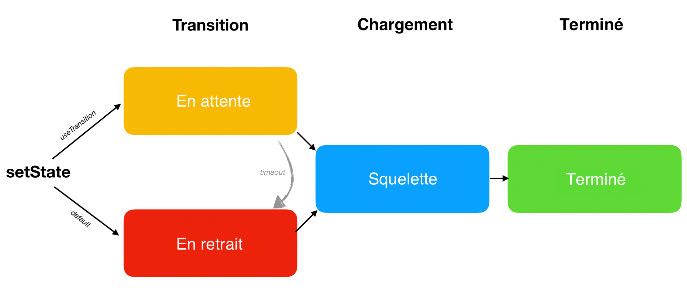

<style>
.scary > blockquote {
  background-color: rgba(237, 51, 21, 0.2);
  border-left-color: #ed3315;
}
</style>

<div class="scary">

> Attention
>
> Cette page décrit **des fonctionnalités expérimentales qui [ne sont pas encore disponibles](/docs/concurrent-mode-adoption.html) dans une version stable**. Ne vous basez pas sur les builds expérimentaux de React pour vos applis en production. Ces fonctionnalités sont susceptibles d’évoluer de façon significative et sans avertissement avant d’intégrer officiellement React.
>
> Cette documentation est destinée aux personnes curieuses ou habituées à adopter les nouvelles technologies très tôt. **Si vous débutez en React, ne vous préoccupez pas de ces fonctionnalités** : vous n’avez pas besoin de les apprendre pour le moment. Par exemple, si vous cherchez un tutoriel sur le chargement de données qui fonctionne dès maintenant, lisez plutôt [cet article](https://www.robinwieruch.de/react-hooks-fetch-data/).

</div>

D’habitude, quand nous mettons à jour l’état, nous nous attendons à ce que nos changements se manifestent immédiatement à l’écran. C’est logique, dans la mesure où nous voulons que notre appli réagisse rapidement aux saisies utilisateurs. Néanmoins, il existe des cas dans lesquels nous pourrions préférer **différer l’apparition d’une mise à jour à l’écran**.

Par exemple, si nous passons d’une page à une autre et que ni le code ni les données pour ce prochain écran ne sont encore chargés, on pourrait trouver frustrant de voir immédiatement s’afficher une page vierge avec un indicateur de chargement. Nous préférerions peut-être rester un peu plus longtemps sur l’écran précédent. Historiquement, implémenter cette approche en React n’était pas chose aisée. Le mode concurrent offre un nouveau jeu d’outils pour y arriver.

- [Transitions](#transitions)
  - [Enrober `setState` dans une transition](#wrapping-setstate-in-a-transition)
  - [Ajouter un indicateur d’attente](#adding-a-pending-indicator)
  - [Le point sur les changements](#reviewing-the-changes)
  - [Où survient la mise à jour ?](#where-does-the-update-happen)
  - [Les transitions sont partout](#transitions-are-everywhere)
  - [Intégrer les transitions au système de conception](#baking-transitions-into-the-design-system)
- [Les trois étapes](#the-three-steps)
  - [Par défaut : En retrait → Squelette → Terminé](#default-receded-skeleton-complete)
  - [Préférable : En attente → Squelette → Terminé](#preferred-pending-skeleton-complete)
  - [Enrobez les fonctionnalités paresseuses avec `<Suspense>`](#wrap-lazy-features-in-suspense)
  - [Le « train » de révélations de Suspense](#suspense-reveal-train)
  - [Différer un indicateur d’attente](#delaying-a-pending-indicator)
  - [En résumé](#recap)
- [Autres approches](#other-patterns)
  - [Dissocier les états à forte et faible priorité](#splitting-high-and-low-priority-state)
  - [Différer une valeur](#deferring-a-value)
  - [`SuspenseList`](#suspenselist)
- [Prochaines étapes](#next-steps)

## Transitions {#transitions}

Reprenons [cette démo](https://codesandbox.io/s/infallible-feather-xjtbu) de la page précédente sur [Suspense pour le chargement de données](/docs/concurrent-mode-suspense.html).

Lorsqu’on clique sur le bouton « Suivant » pour basculer le profil actif, les données de la page existante disparaissent immédiatement, et nous avons à nouveau un indicateur de chargement pour la page entière. On pourrait qualifier cet état de chargement « d’indésirable ». **Ce serait sympa si nous pouvions « sauter » cet état et attendre qu’un peu de contenu arrive avant de transiter vers le nouvel écran.**

React offre un nouveau Hook intégré `useTransition()` pour nous y aider.

On peut l’utiliser en trois temps.

Tout d’abord, nous devons nous assurer d’utiliser effectivement le mode concurrent. Nous en reparlerons plus tard dans [Adopter le mode concurrent](/docs/concurrent-mode-adoption.html), mais pour l’instant il suffit de vérifier qu’on utilise bien `ReactDOM.createRoot()` au lieu de `ReactDOM.render()` afin que ce mode fonctionne :

```js
const rootElement = document.getElementById("root");
// Activation explicite du mode concurrent
ReactDOM.createRoot(rootElement).render(<App />);
```

Ensuite, nous ajouterons un import du Hook `useTransition` de React :

```js
import React, { useState, useTransition, Suspense } from "react";
```

Enfin, nous l’utiliserons au sein de notre composant `App` :

```js{3-5}
function App() {
  const [resource, setResource] = useState(initialResource);
  const [startTransition, isPending] = useTransition({
    timeoutMs: 3000
  });
  // ...
```

**Pour le moment, par lui-même, ce code ne fait rien.**  Nous allons devoir utiliser les valeurs renvoyées par ce Hook pour mettre en place notre transition d’état. Voici les deux valeurs que renvoie `useTransition` :

* `startTransition` est une fonction. Nous l’utiliserons pour indiquer à React *quelle* mise à jour d’état nous souhaitons différer.
* `isPending` est un booléen, grâce auquel React nous indique si nous sommes actuellement en train d’attendre la fin de la transition.

Nous allons les utiliser dans un instant.

Remarquez que nous passons un objet de configuration à `useTransition`. Sa propriété `timeoutMs` indique **combien de temps nous acceptons d’attendre que la transition se termine**. En passant `{ timeoutMs: 3000 }`, nous disons « si le prochain profil prend plus de 3 secondes à charger, affiche le gros *spinner*—mais d’ici là, tu peux rester sur l’écran précédent ».

### Enrober `setState` dans une transition {#wrapping-setstate-in-a-transition}

Notre gestionnaire de clic pour le bouton « Suivant » déclenche la bascule du profil courant dans notre état local :

```js{4}
<button
  onClick={() => {
    const nextUserId = getNextId(resource.userId);
    setResource(fetchProfileData(nextUserId));
  }}
>
```

Nous allons enrober cette mise à jour de l’état dans un appel à `startTransition`. C’est ainsi que nous indiquons à React que **ça ne nous dérange pas que React diffère cette mise à jour de l’état** si elle entraînait un état de chargement indésirable :

```js{3,6}
<button
  onClick={() => {
    startTransition(() => {
      const nextUserId = getNextId(resource.userId);
      setResource(fetchProfileData(nextUserId));
    });
  }}
>
```

**[Essayez sur CodeSandbox](https://codesandbox.io/s/musing-driscoll-6nkie)**

Cliquez sur « Suivant » plusieurs fois. Remarquez comme une différence se fait déjà bien sentir. **Au lieu de voir immédiatement un écran vide suite au clic, nous continuons à voir l’écran précédent pendant un instant.**  Une fois les données chargées, React transite sur le nouvel écran.

Si nous ajustons nos API pour mettre 5 secondes à répondre, [nous pouvons confirmer](https://codesandbox.io/s/relaxed-greider-suewh) que React décide alors « d’abandonner » en transitant vers le prochain écran au bout de 3 secondes. C’est dû à notre argument `{ timeoutMs: 3000 }` dans `useTransition()`. À titre d’exemple, si nous avions plutôt passé `{ timeoutMs: 60000 }`, il aurait attendu une minute entière.

### Ajouter un indicateur d’attente {#adding-a-pending-indicator}

Il reste quelque chose qui semble cassé dans [notre dernier exemple](https://codesandbox.io/s/musing-driscoll-6nkie). Bien sûr, c’est sympa de ne pas voir un « mauvais » état de chargement. **Mais n’avoir aucun indicateur de progression est quelque part encore pire !**  Quand on clique sur « Suivant », rien ne se passe et on dirait que l’appli est cassée.

Notre appel à `useTransition()` renvoie deux valeurs : `startTransition` et `isPending`.

```js
  const [startTransition, isPending] = useTransition({ timeoutMs: 3000 });
```

Nous avons déjà utilisé `startTransition` pour enrober la mise à jour de l’état. Nous allons maintenant utiliser `isPending` en prime. React nous fournit ce booléen pour nous indiquer que **nous sommes en train d’attendre la fin d’une transition.**  Nous l’utiliserons pour indiquer que quelque chose se passe :

```js{4,14}
return (
  <>
    <button
      disabled={isPending}
      onClick={() => {
        startTransition(() => {
          const nextUserId = getNextId(resource.userId);
          setResource(fetchProfileData(nextUserId));
        });
      }}
    >
      Suivant
    </button>
    {isPending ? " Chargement..." : null}
    <ProfilePage resource={resource} />
  </>
);
```

**[Essayez sur CodeSandbox](https://codesandbox.io/s/jovial-lalande-26yep)**

Voilà qui rend beaucoup mieux !  Quand nous cliquons sur « Suivant », le bouton est désactivé puisque cliquer dessus plusieurs fois n’aurait pas de sens. Et le nouveau texte « Chargement... » indique à l’utilisateur que l’appli n’a pas gelé.

### Le point sur les changements {#reviewing-the-changes}

Revoyons l’ensemble des modifications apportées à notre [exemple d’origine](https://codesandbox.io/s/infallible-feather-xjtbu) :

```js{3-5,9,11,14,19}
function App() {
  const [resource, setResource] = useState(initialResource);
  const [startTransition, isPending] = useTransition({
    timeoutMs: 3000
  });
  return (
    <>
      <button
        disabled={isPending}
        onClick={() => {
          startTransition(() => {
            const nextUserId = getNextId(resource.userId);
            setResource(fetchProfileData(nextUserId));
          });
        }}
      >
        Suivant
      </button>
      {isPending ? " Chargement..." : null}
      <ProfilePage resource={resource} />
    </>
  );
}
```

**[Essayez sur CodeSandbox](https://codesandbox.io/s/jovial-lalande-26yep)**

Il ne nous aura fallu que sept lignes de code pour ajouter cette transition :

* Nous avons importé le Hook `useTransition` et l’avons utilisé dans le composant pour mettre à jour l’état.
* Nous avons passé `{ timeoutMs: 3000 }` pour rester sur l’écran précédent à raison de 3 secondes maximum.
* Nous avons enrobé la mise à jour de l’état par un `startTransition` pour indiquer à React qu’il pouvait choisir de la différer.
* Nous utilisons `isPending` pour communiquer la notion d’une transition d’état en cours à l’utilisateur et désactiver le bouton.

Résultat : cliquer sur « Suivant » n’entraîne pas une transition d’état immédiate vers un état de chargement « indésirable » mais reste plutôt sur l’écran précédent pour y communiquer une progression.

### Où survient la mise à jour ? {#where-does-the-update-happen}

Voilà qui n’était pas très difficile à implémenter. Cependant, si vous commencez à réfléchir sur les mécanismes qui rendent ce résultat possible, ça risque de vous faire quelques nœuds au cerveau. Si nous définissons l’état, comment se fait-il que nous n’en constations pas le résultat immédiatement ? *Où* a lieu le prochain rendu de `<ProfilePage>` ?

Clairement, les deux « versions » de `<ProfilePage>` existent en même temps. On sait que l’ancienne existe parce qu’on la voit à l’écran et qu’on y affiche même un indicateur de progression. Et on sait que la nouvelle version existe aussi *quelque part*, parce que c’est celle qu’on attend !

**Mais comment peut-on avoir en même temps deux versions du même composant ?**

On touche là à l’essence-même du mode concurrent. Nous avons [dit précédemment](/docs/concurrent-mode-intro.html#intentional-loading-sequences) que c’était un peu comme si React travaillait sur la mise à jour de l’état sur une « branche ». Une autre façon de conceptualiser ça consiste à se dire qu’enrober une mise à jour de l’état avec `startTransition` déclenche son rendu *« dans un univers parallèle »*, comme dans les films de science-fiction. Nous ne « voyons » pas cet univers directement—mais nous pouvons en détecter des signaux qui nous informent que quelque chose s’y passe (`isPending`). Quand la mise à jour est enfin prête, nos « univers » fusionnent, et nous voyons le résultat à l’écran !

Jouez un peu plus avec la [démo](https://codesandbox.io/s/jovial-lalande-26yep), et tentez d’imaginez ce comportement derrière elle.

Bien entendu, ces deux versions de l’arbre effectuant leur rendu *en même temps* ne sont qu’une illusion, tout comme l’idée que tous les programmes tournent sur votre ordinateur en même temps est une illusion. Un système d’exploitation bascule entre les différentes applications très rapidement. De façon similaire, React peut basculer entre la version de votre arbre affichée à l’écran et celle « en préparation » pour l’affichage suivant.

Une API comme `useTransition` vous permet de vous concentrer sur l’expérience utilisateur souhaitée, sans avoir à vous encombrer l’esprit avec les détails techniques de son implémentation. Néanmoins, imaginer que les mises à jour enrobées par `useTransition` surviennent « sur une branche » ou dans un « monde parallèle » reste une métaphore utile.

### Les transitions sont partout {#transitions-are-everywhere}

Comme nous l’avons appris dans [Suspense pour le chargement de données](/docs/concurrent-mode-suspense.html), tout composant peut « se suspendre » à tout moment s’il a besoin de données qui ne sont pas encore disponibles. Nous pouvons positionner stratégiquement des périmètres `<Suspense>` dans différentes parties de l’arbre pour gérer ça, mais ça ne sera pas toujours suffisant.

Reprenons notre [première démo de Suspense](https://codesandbox.io/s/frosty-hermann-bztrp) qui ne se préoccupait que d’un profil. Pour le moment, elle ne récupère les données qu’une seule fois. Ajoutons un bouton « Rafraîchir » qui vérifiera si le serveur a des mises à jour à proposer.

Notre premier essai pourrait ressembler à ceci :

```js{6-8,13-15}
const initialResource = fetchUserAndPosts();

function ProfilePage() {
  const [resource, setResource] = useState(initialResource);

  function handleRefreshClick() {
    setResource(fetchUserAndPosts());
  }

  return (
    <Suspense fallback={<h1>Chargement du profil...</h1>}>
      <ProfileDetails resource={resource} />
      <button onClick={handleRefreshClick}>
        Rafraîchir
      </button>
      <Suspense fallback={<h1>Chargement des publications...</h1>}>
        <ProfileTimeline resource={resource} />
      </Suspense>
    </Suspense>
  );
}
```

**[Essayez sur CodeSandbox](https://codesandbox.io/s/boring-shadow-100tf)**

Dans cet exemple, nous commençons à charger les données lorsque le composant se charge *et* à chaque fois que nous activons « Rafraîchir ». Nous plaçons le résultat de l’appel à `fetchUserAndPosts()` dans l’état pour que les composants plus bas dans l’arbre puissent commencer à lire les nouvelles données de la requête que nous venons de déclencher.

On peut voir dans [cet exemple](https://codesandbox.io/s/boring-shadow-100tf) qu’activer « Rafraîchir » fonctionne bien. Les composants `<ProfileDetails>` et `<ProfileTimeline>` reçoivent une nouvelle prop `resource` qui représente les données à jour, ils « se suspendent » parce que la réponse n’est pas encore là, et nous en voyons les UI de repli. Une fois la réponse chargée, nous voyons les publications mises à jour (notre API factice en ajoute toutes les 3 secondes).

Cependant, l’expérience obtenue est très saccadée. Nous étions en train de consulter une page, mais celle-ci a été remplacée par un état de chargement alors même que nous étions en train d’interagir avec. C’est déroutant. **Tout comme précédemment, pour éviter d’afficher un état de chargement indésirable, nous pouvons enrober la mise à jour de l’état par une transition :**

```js{2-5,9-11,21}
function ProfilePage() {
  const [startTransition, isPending] = useTransition({
    // Attendre 10 secondes avant d’afficher l’UI de repli
    timeoutMs: 10000
  });
  const [resource, setResource] = useState(initialResource);

  function handleRefreshClick() {
    startTransition(() => {
      setResource(fetchProfileData());
    });
  }

  return (
    <Suspense fallback={<h1>Chargement du profil...</h1>}>
      <ProfileDetails resource={resource} />
      <button
        onClick={handleRefreshClick}
        disabled={isPending}
      >
        {isPending ? "Rafraîchissement..." : "Rafraîchir"}
      </button>
      <Suspense fallback={<h1>Chargement des publications...</h1>}>
        <ProfileTimeline resource={resource} />
      </Suspense>
    </Suspense>
  );
}
```

**[Essayez sur CodeSandbox](https://codesandbox.io/s/sleepy-field-mohzb)**

Voilà qui est beaucoup plus agréable ! Cliquer sur « Rafraîchir » ne nous vire plus de la page que nous étions en train de consulter. Nous voyons que quelque chose est en train de charger « en place » dans le contenu, et lorsque les données sont enfin prêtes, elles sont automatiquement affichées.

### Intégrer les transitions au système de conception {#baking-transitions-into-the-design-system}

Nous voyons désormais qu’il est *très* courant d’avoir besoin de `useTransition`. Presque chaque clic sur un bouton ou autre interaction qui pourrait entraîner la suspension d’un composant bénéficierait d’un enrobage dans `useTransition` pour éviter de masquer accidentellement du contenu avec lequel l’utilisateur interagit.

Ça peut vite entraîner beaucoup de code répétitif d’un composant à l’autre. C’est pourquoi **nous conseillons généralement d’intégrer `useTransition` dans le *système de conception* des composants de votre appli**. On pourrait par exemple extraire la logique de transition dans notre propre composant `<Button>` :

```js{7-9,20,24}
function Button({ children, onClick }) {
  const [startTransition, isPending] = useTransition({
    timeoutMs: 10000
  });

  function handleClick() {
    startTransition(() => {
      onClick();
    });
  }

  const spinner = (
    // ...
  );

  return (
    <>
      <button
        onClick={handleClick}
        disabled={isPending}
      >
        {children}
      </button>
      {isPending ? spinner : null}
    </>
  );
}
```

**[Essayez sur CodeSandbox](https://codesandbox.io/s/modest-ritchie-iufrh)**

Remarquez que le bouton ne se soucie pas de savoir *quel* état vous mettez à jour. Il enrobe dans une transition *n’importe quelle* mise à jour d’état qui survient au sein du gestionnaire `onClick`. À présent que notre `<Button>` s’occupe tout seul de mettre la transition en place, le composant `<ProfilePage>` n’a plus besoin de s’en occuper lui-même :

```js{4-6,11-13}
function ProfilePage() {
  const [resource, setResource] = useState(initialResource);

  function handleRefreshClick() {
    setResource(fetchProfileData());
  }

  return (
    <Suspense fallback={<h1>Chargement du profil...</h1>}>
      <ProfileDetails resource={resource} />
      <Button onClick={handleRefreshClick}>
        Rafraîchir
      </Button>
      <Suspense fallback={<h1>Chargement des publications...</h1>}>
        <ProfileTimeline resource={resource} />
      </Suspense>
    </Suspense>
  );
}
```

**[Essayez sur CodeSandbox](https://codesandbox.io/s/modest-ritchie-iufrh)**

Quand on clique sur un bouton, celui-ci démarre une transition et appelle `props.onClick()` à l’intérieur—ce qui déclenche `handleRefreshClick` dans le composant `<ProfilePage>`. On commence à charger les données à jour, mais ça n’active pas l’UI de repli car nous sommes au sein d’une transition, et que l’expiration de 10 secondes spécifiée dans l’appel à `useTransition` n’est pas encore atteinte. Pendant que la transition est active, le bouton affiche un indicateur de chargement intégré.

On voit maintenant comment le mode concurrent nous aide à obtenir une bonne expérience utilisateur sans pour autant sacrifier l’isolation et la modularité des composants. React coordonne la transition.

## Les trois étapes {#the-three-steps}

À ce stade, nous avons exploré tous les états visuels distincts à travers lesquels passe une mise à jour. Dans cette section, nous allons leur donner des noms et discuter de la progression de l’un à l’autre.

<br>



Tout au bout, nous avons l’état **Terminé**. C’est là que nous voulons arriver au final. Il représente le moment où le prochain écran est pleinement affiché et ne charge plus de données supplémentaires.

Mais avant que notre écran soit Terminé, nous aurons peut-être besoin de charger des données ou du code. Lorsque nous serons sur le prochain écran, mais que certaines parties seront encore en train de charger, nous appellerons ça l’état **Squelette**.

Pour finir, il y a deux principales façons d’arriver à l’état Squelette. Nous illustrerons la différence entre les deux à l’aide d’un exemple concret.

### Par défaut : En retrait → Squelette → Terminé {#default-receded-skeleton-complete}

Ouvrez [cet exemple](https://codesandbox.io/s/prod-grass-g1lh5) et cliquez sur « Ouvrir le profil ». Vous verrez plusieurs états visuels l’un après l’autre :

* **En retrait** : pendant une seconde, vous verrez l’UI de repli `<h1>Chargement de l’appli...</h1>`.
* **Squelette** : vous verrez le composant `<ProfilePage>` avec à l’intérieur `<h2>Chargement des publications...</h2>`.
* **Terminé** : vous verrez le composant `<ProfilePage>` sans UI de repli à l’intérieur. Tout aura été chargé.

Comment sépare-t-on les états En retrait et Squelette ? La différence tient au fait que l’état **En retrait** donne plus l’impression de « faire un pas en arrière » pour l’utilisateur, alors que l’état **Squelette** donne le sentiment de « faire un pas en avant » dans notre progression vers davantage de contenu.

Dans cet exemple, nous avons commencé notre parcours sur la `<HomePage>` :

```js
<Suspense fallback={...}>
  {/* écran précédent */}
  <HomePage />
</Suspense>
```

Après le clic, React a commencé à afficher l’écran suivant :

```js
<Suspense fallback={...}>
  {/* prochain écran */}
  <ProfilePage>
    <ProfileDetails />
    <Suspense fallback={...}>
      <ProfileTimeline />
    </Suspense>
  </ProfilePage>
</Suspense>
```

Tant `<ProfileDetails>` que `<ProfileTimeline>` ont besoin de données pour s’afficher, alors ils se suspendent :

```js{4,6}
<Suspense fallback={...}>
  {/* prochain écran */}
  <ProfilePage>
    <ProfileDetails /> {/* se suspend ! */}
    <Suspense fallback={<h2>Chargement des publications...</h2>}>
      <ProfileTimeline /> {/* se suspend ! */}
    </Suspense>
  </ProfilePage>
</Suspense>
```

Quand un composant se suspend, React a besoin d’afficher l’UI de repli la plus proche. Mais dans le cas de `<ProfileDetails>` celle-ci est au niveau racine :

```js{2,3,7}
<Suspense fallback={
  // On voit cette UI de repli à cause de de <ProfileDetails>
  <h1>Chargement de l’appli...</h1>
}>
  {/* prochain écran */}
  <ProfilePage>
    <ProfileDetails /> {/* se suspend ! */}
    <Suspense fallback={...}>
      <ProfileTimeline />
    </Suspense>
  </ProfilePage>
</Suspense>
```

C’est pourquoi lorsque nous cliquons sur un bouton, on a l’impression de « faire un pas en arrière ». Le périmètre `<Suspense>` qui affichait jusque-là du contenu utile (`<HomePage />`) a dû « se mettre en retrait » pour afficher l’UI de repli (`<h1>Chargement de l’appli...</h1>`). On appelle ça l’état **En retrait**.

Au fil du chargement des données, React retentera l’affichage, et `<ProfileDetails>` pourra s’afficher correctement. Nous aboutirons alors à l’état **Squelette**. On voit la nouvelle page avec des parties manquantes :

```js{6,7,9}
<Suspense fallback={...}>
  {/* prochain écran */}
  <ProfilePage>
    <ProfileDetails />
    <Suspense fallback={
      // On voit cette UI de repli à cause de <ProfileTimeline>
      <h2>Chargement des publications...</h2>
    }>
      <ProfileTimeline /> {/* se suspend ! */}
    </Suspense>
  </ProfilePage>
</Suspense>
```

Là aussi, au final, nous atteindrons l’état **Terminé**.

Ce scénario (En retrait → Squelette → Terminé) est celui par défaut. Cependant, l’état En retrait est désagréable parce qu’il « masque » des informations existantes. C’est pourquoi React nous permet de choisir une séquence différente (**En attente** → Squelette → Terminé) avec `useTransition`.

### Préférable : En attente → Squelette → Terminé {#preferred-pending-skeleton-complete}

Quand nous utilisons `useTransition`, React nous permet de « rester » sur l’écran précédent—et d’y placer un indicateur d’attente. Nous appelons ça l’état **En attente**. Le ressenti est nettement meilleur que pour l’état En retrait, car aucun contenu existant ne disparaît, et la page reste interactive.

Vous pouvez comparer ces deux exemples pour ressentir la différence :

* Défaut : [En retrait → Squelette → Terminé](https://codesandbox.io/s/prod-grass-g1lh5)
* **Préférable : [En attente → Squelette → Terminé](https://codesandbox.io/s/focused-snow-xbkvl)**

La seule différence entre ces deux exemples tient à ce que le premier utilise des `<button>` classiques, alors que le second utilise notre composant personnalisé `<Button>`, qui intègre un `useTransition`.

### Enrobez les fonctionnalités paresseuses avec `<Suspense>` {#wrap-lazy-features-in-suspense}

Ouvrez [cet exemple](https://codesandbox.io/s/nameless-butterfly-fkw5q). Quand vous activez un bouton, vous voyez l’état En attente pendant une seconde avant de passer à la suite. Cette transition est agréable et fluide.

Nous allons maintenant ajouter une fonctionnalité toute neuve à la page de profil : une liste de faits amusants relatifs à la personne :

```js{8,13-25}
function ProfilePage({ resource }) {
  return (
    <>
      <ProfileDetails resource={resource} />
      <Suspense fallback={<h2>Chargement des publications...</h2>}>
        <ProfileTimeline resource={resource} />
      </Suspense>
      <ProfileTrivia resource={resource} />
    </>
  );
}

function ProfileTrivia({ resource }) {
  const trivia = resource.trivia.read();
  return (
    <>
      <h2>Faits amusants</h2>
      <ul>
        {trivia.map(fact => (
          <li key={fact.id}>{fact.text}</li>
        ))}
      </ul>
    </>
  );
}
```

**[Essayez sur CodeSandbox](https://codesandbox.io/s/focused-mountain-uhkzg)**

Si à présent vous activez « Ouvrir le profil », vous verrez que quelque chose cloche. Ça prend désormais sept bonnes secondes pour effectuer la transition !  C’est parce que notre API de faits amusants est trop lente. Imaginons que nous ne puissions pas l’accélérer : comment alors améliorer l’expérience utilisateur malgré cette contrainte ?

Si nous ne voulons pas rester à l’état En attente trop longtemps, notre premier instinct pourrait être d’ajuster le `timeoutMs` dans `useTransition` pour le réduire, par exemple à `3000`. Vous pouvez essayer ça [ici](https://codesandbox.io/s/practical-kowalevski-kpjg4). Ça nous permet d’échapper à un état En attente prolongé, mais ça ne nous donne pas pour autant des contenus utiles à afficher !

Il y a un moyen plus simple de résoudre ça. **Plutôt que d’abréger la transition, nous pouvons « déconnecter » le composant lent de celle-ci** en l’enrobant dans son propre périmètre `<Suspense>` :

```js{8,10}
function ProfilePage({ resource }) {
  return (
    <>
      <ProfileDetails resource={resource} />
      <Suspense fallback={<h2>Chargement des publications...</h2>}>
        <ProfileTimeline resource={resource} />
      </Suspense>
      <Suspense fallback={<h2>Chargement des faits amusants...</h2>}>
        <ProfileTrivia resource={resource} />
      </Suspense>
    </>
  );
}
```

**[Essayez sur CodeSandbox](https://codesandbox.io/s/condescending-shape-s6694)**

Voilà qui met en lumière un point important. React préfèrera toujours arriver à l’état Squelette le plus tôt possible. Même si nous utilisons partout des transitions à expiration longue, React ne restera pas dans l’état En attente plus longtemps que le strict nécessaire pour éviter l’état En retrait.

**Si une fonctionnalité ne constitue pas une partie vitale du prochain écran, enrobez-la dans un `<Suspense>` pour la laisser se charger paresseusement.**  Vous garantissez ainsi que le reste du contenu sera visible le plus tôt possible. Réciproquement, si un écran *n’a aucun intérêt à être affiché* sans un composant donné, tel que `<ProfileDetails>` dans notre exemple, ne *l’enrobez pas* dans un `<Suspense>`. Ainsi les transitions « attendront » que ce composant soit disponible.

### Le « train » de révélations de Suspense {#suspense-reveal-train}

Lorsque nous sommes déjà sur le prochain écran, il peut arriver que les données nécessaires pour « déverrouiller » des périmètres `<Suspense>` distincts arrivent en succession rapide. Par exemple, deux réponses distinctes pourraient arriver respectivement après 1 000 et 1 050 ms. Si vous avez déjà attendu une seconde, vous ne percevrez pas l’attente supplémentaire de 50 ms. C’est pourquoi React ne révèle les périmètres `<Suspense>` que selon un horaire déterminé, comme un « train » qui arriverait périodiquement. Il échange un court délai contre une réduction des modifications majeures à la mise en page et du nombre de changements visuels présentés à l’utilisateur.

Vous pouvez voir une démo de ça [ici](https://codesandbox.io/s/admiring-mendeleev-y54mk). Les réponses « publications » et « faits amusants » arrivent à 100 ms l’une de l’autre. Mais React les regroupe pour « révéler » leurs périmètres en une seule passe.

### Différer un indicateur d’attente {#delaying-a-pending-indicator}

Notre composant `Button` affichera immédiatement l’indicateur d’attente une fois cliqué :

```js{2,13}
function Button({ children, onClick }) {
  const [startTransition, isPending] = useTransition({
    timeoutMs: 10000
  });

  // ...

  return (
    <>
      <button onClick={handleClick} disabled={isPending}>
        {children}
      </button>
      {isPending ? spinner : null}
    </>
  );
}
```

**[Essayez sur CodeSandbox](https://codesandbox.io/s/floral-thunder-iy826)**

Ça signale à l’utilisateur qu’un travail a lieu. Toutefois, si cette transition est relativement courte (disons, moins de 500 ms), cet affichage est plus une distraction qu’autre chose et peut faire que la transition elle-même semble *plus lente*.

Une solution possible à ça consiste à *différer l’affichage du _spinner_ lui-même* :

```css
.DelayedSpinner {
  animation: 0s linear 0.5s forwards makeVisible;
  visibility: hidden;
}

@keyframes makeVisible {
  to {
    visibility: visible;
  }
}
```

```js{2-4,10}
const spinner = (
  <span className="DelayedSpinner">
    {/* ... */}
  </span>
);

return (
  <>
    <button onClick={handleClick}>{children}</button>
    {isPending ? spinner : null}
  </>
);
```

**[Essayez sur CodeSandbox](https://codesandbox.io/s/gallant-spence-l6wbk)**

Avec cette modification, même si nous sommes dans l’état En attente, nous n’affichons aucune indication à l’utilisateur jusqu’à ce que 500 ms se soient écoulés. Ça peut sembler une amélioration superflue quand les réponses API sont lentes. Mais comparez le ressenti [avant](https://codesandbox.io/s/thirsty-liskov-1ygph) et [après](https://codesandbox.io/s/hardcore-http-s18xr) lorsque l’appel API est rapide. Même si le reste du code n’a pas changé, supprimer un état de chargement « trop rapide » améliore les performances perçues en évitant d’attirer l’attention de l’utilisateur.

### En résumé {#recap}

Les points les plus importants que nous avons appris jusqu’à présent sont :

* Par défaut, notre séquence de chargement est En retrait → Squelette → Terminé.
* L’état En retrait n’est pas très agréable parce qu’il masque du contenu existant.
* Avec `useTransition`, nous pouvons choisir de commencer plutôt par un état En attente. Ça nous gardera sur l’écran précédent pendant que le prochain se prépare.
* Si nous ne voulons pas qu’un composant ralentisse une transition, nous pouvons l’enrober dans son propre périmètre `<Suspense>`.
* Plutôt que de faire un `useTransition` au sein de tous nos composants, nous pouvons l’intégrer à notre système de conception.

## Autres approches {#other-patterns}

Les transitions sont probablement l’approche pour une UI concurrente que vous rencontrerez le plus fréquemment, mais il existe d’autres approches que vous pourriez trouver utiles.

### Dissocier les états à forte et faible priorité {#splitting-high-and-low-priority-state}

Quand vous concevez des composants React, vous cherchez dans l’idéal à déterminer la « représentation minimale » de l’état. Par exemple, au lieu de conserver dans l’état `firstName`, `lastName` et `fullName`, il est généralement préférable de n’y stocker que `firstName` et `lastName`, et de calculer `fullName` lors du rendu. Ça nous permet d’éviter les erreurs dues à une mise à jour partielle de l’état.

En revanche, le mode concurrent recèle des cas où vous pourriez *vouloir* « dupliquer » des données dans des variables d’état distinctes. Prenez cette minuscule appli de traduction :

```js
const initialQuery = "Bonjour, monde";
const initialResource = fetchTranslation(initialQuery);

function App() {
  const [query, setQuery] = useState(initialQuery);
  const [resource, setResource] = useState(initialResource);

  function handleChange(e) {
    const value = e.target.value;
    setQuery(value);
    setResource(fetchTranslation(value));
  }

  return (
    <>
      <input
        value={query}
        onChange={handleChange}
      />
      <Suspense fallback={<p>Chargement...</p>}>
        <Translation resource={resource} />
      </Suspense>
    </>
  );
}

function Translation({ resource }) {
  return (
    <p>
      <b>{resource.read()}</b>
    </p>
  );
}
```

**[Essayez sur CodeSandbox](https://codesandbox.io/s/brave-villani-ypxvf)**

Remarquez comme, lorsque vous tapez dans le champ de saisie, le composant `<Translation>` se suspend, vous affichant l’UI de repli `<p>Chargement...</p>` jusqu’à obtenir des résultats à jour. Ce n’est pas idéal. Il serait préférable que vous puissiez brièvement voir la *précédente* traduction, tandis que nous chargeons la prochaine.

D’ailleurs, si vous ouvrez la console, vous y verrez cet avertissement :

```
Warning: App triggered a user-blocking update that suspended.

The fix is to split the update into multiple parts: a user-blocking update to provide immediate feedback, and another update that triggers the bulk of the changes.

Refer to the documentation for useTransition to learn how to implement this pattern.
```

*Avertissement : l’appli a déclenché une mise à jour suspensive, bloquante pour l’utilisateur.*

*Pour corriger ça, découpez la mise à jour en plusieurs parties : une bloquante qui fournit un retour visuel immédiat, et une qui déclenche l’essentiel des modifications.*

*Consultez la documentation de useTransition pour en apprendre davantage sur la façon d’implémenter cette approche.*

Comme nous l’avons vu auparavant, si une mise à jour d’état entraîne la suspension d’un composant, cette mise à jour devrait être enrobée dans une transition. Essayons d’ajouter `useTransition` à notre composant :

```js{4-6,10,13}
function App() {
  const [query, setQuery] = useState(initialQuery);
  const [resource, setResource] = useState(initialResource);
  const [startTransition, isPending] = useTransition({
    timeoutMs: 5000
  });

  function handleChange(e) {
    const value = e.target.value;
    startTransition(() => {
      setQuery(value);
      setResource(fetchTranslation(value));
    });
  }

  // ...

}
```

**[Essayez sur CodeSandbox](https://codesandbox.io/s/zen-keldysh-rifos)**

Essayez de saisir une valeur à présent. Quelque chose cloche !  Le champ n’est mis à jour que très lentement.

Nous avons corrigé le premier problème (la suspension hors d’une transition). Mais maintenant, à cause de la transition, notre état n’est pas mis à jour immédiatement : il ne peut donc pas « piloter » le champ contrôlé !

La solution **consiste à découper l’état en deux parties :** une partie à « forte priorité » qui est mise à jour tout de suite, et une à « faible priorité » qui peut se permettre d’attendre la transition.

Dans notre exemple, on a déjà deux variables d’état. Le texte saisi est dans `query` et la traduction est lue depuis `resource`. Nous voulons que les modifications apportées à `query` soient traitées immédiatement, mais que celles de `resource` (c’est-à-dire le chargement d’une nouvelle traduction) déclenchent une transition.

Du coup le bon correctif consiste à mettre `setQuery` (qui ne suspend rien) *hors* de la transition, mais de placer `setResource` (qui suspendra) *à l’intérieur* de celle-ci.

```js{4,5}
function handleChange(e) {
  const value = e.target.value;

  // Hors de la transition (urgent)
  setQuery(value);

  startTransition(() => {
    // Dans la transition (peut être différé)
    setResource(fetchTranslation(value));
  });
}
```

**[Essayez sur CodeSandbox](https://codesandbox.io/s/lively-smoke-fdf93)**

Avec cet ajustement, tout fonctionne comme on le souhaite. On peut taper une valeur et la voir immédiatement, quant à la traduction, elle « rattrape » ce qu’on a saisi un peu plus tard.

### Différer une valeur {#deferring-a-value}

Par défaut, React assurera toujours un rendu cohérent de l'UI. Prenez le code suivant :

```js
<>
  <ProfileDetails user={user} />
  <ProfileTimeline user={user} />
</>
```

React garantit qu’à tout moment, quand nous regardons ces composants à l’écran, ils reflèteront les données issues du même `user`. Si un `user` différent nous est passé suite à une mise à jour d’état, vous verrez les deux composants se mettre à jour d’un bloc. Il serait impossible d’enregistrer une vidéo de l’écran et de trouver ensuite un seul *frame* où ces composants afficheraient des données issues d’objets `user` différents. (Et si vous y arrivez un jour, ouvrez un ticket, c’est un bug !)

Cette approche a du sens dans la vaste majorité des cas. Une UI incohérente est déroutante voire dangereuse pour les utilisateurs. (Par exemple, vous imaginez bien que ce serait l’enfer si le bouton Envoyer de Messenger et le panneau de conversation n’étaient « pas d’accord » sur la conversation en cours.)

Ceci dit, il peut parfois être utile d’introduire volontairement un décalage. On pourrait le faire manuellement en « découpant » l’état comme on l’a fait ci-dessus, mais React nous offre un Hook prédéfini pour ça :

```js
import { useDeferredValue } from 'react';

const deferredValue = useDeferredValue(value, {
  timeoutMs: 5000
});
```

Pour illustrer cette fonctionnalité, nous allons utiliser [l’exemple de la bascule de profil](https://codesandbox.io/s/musing-ramanujan-bgw2o). Cliquez sur le bouton « Suivant » et remarquez que ça prend une seconde pour achever la transition.

Disons que la récupération des détails utilisateurs est très rapide et ne prend que 300 millisecondes. Pour le moment, nous attendons une seconde entière parce que nous avons besoin tant des détails de l’utilisateur que de ses publications pour afficher une page de profil cohérente. Mais qu’en serait-il si nous voulions afficher les détails plus tôt ?

Si nous acceptons de sacrifier la cohérence, nous pouvons **passer des données potentiellement obsolètes aux composants qui retardent notre transition**. C’est précisément ce que `useDeferredValue()` nous permet de faire :

```js{2-4,10,11,21}
function ProfilePage({ resource }) {
  const deferredResource = useDeferredValue(resource, {
    timeoutMs: 1000
  });
  return (
    <Suspense fallback={<h1>Chargement du profil...</h1>}>
      <ProfileDetails resource={resource} />
      <Suspense fallback={<h1>Chargement des publications...</h1>}>
        <ProfileTimeline
          resource={deferredResource}
          isStale={deferredResource !== resource}
        />
      </Suspense>
    </Suspense>
  );
}

function ProfileTimeline({ isStale, resource }) {
  const posts = resource.posts.read();
  return (
    <ul style={{ opacity: isStale ? 0.7 : 1 }}>
      {posts.map(post => (
        <li key={post.id}>{post.text}</li>
      ))}
    </ul>
  );
}
```

**[Essayez sur CodeSandbox](https://codesandbox.io/s/vigorous-keller-3ed2b)**

Le compromis que nous faisons ici tient à ce que `<ProfileTimeline>` sera incohérente vis-à-vis des autres composants et affichera potentiellement un élément plus ancien. En cliquant sur « Suivant » plusieurs fois, vous allez le remarquer. Mais grâce à ça, nous pouvons raccourcir le temps de la transition de 1 000 ms à 300 ms.

La pertinence d’un tel compromis dépend de votre situation. Mais ça reste un outil bien pratique, surtout quand le contenu ne change pas de façon très prononcée d’un élement à l’autre, et que l’utilisateur est susceptible de ne même pas remarquer qu’ils ont des données obsolètes pendant une seconde.

Notez bien que `useDeferredValue` n’est pas *seulement* utile pour le chargement de données. Elle nous aide aussi lorsqu’une arborescence de composants lourde ralentit une interaction (par ex. la saisie dans un champ). Tout comme nous pouvons « différer » une valeur qui prend trop longtemps à se charger (et afficher l’ancienne valeur en dépit des mises à jour d’autres composants), nous pouvons faire la même chose à des arbres qui prennent trop de temps pour leur rendu.

Par exemple, prenez une liste filtrable comme celle-ci :

```js
function App() {
  const [text, setText] = useState("bonjour");

  function handleChange(e) {
    setText(e.target.value);
  }

  return (
    <div className="App">
      <label>
        Tapez une valeur dans le champ :{" "}
        <input value={text} onChange={handleChange} />
      </label>
      ...
      <MySlowList text={text} />
    </div>
  );
}
```

**[Essayez sur CodeSandbox](https://codesandbox.io/s/pensive-shirley-wkp46)**

Dans cet exemple, **chaque élément dans `<MySlowList>` est artificiellement ralenti : chacun d’eux bloque le thread pour quelques millisecondes**. On ne ferait jamais ça dans une véritable appli, mais ça nous aide à simuler ce qui pourrait se passer dans une arborescence de composants profonde qui ne contiendrait pas pour autant d’endroits évidents à optimiser.

On peut voir comme la saisie dans le champ cause une expérience saccadée. Ajoutons maintenant `useDeferredValue` :

```js{3-5,18}
function App() {
  const [text, setText] = useState("bonjour");
  const deferredText = useDeferredValue(text, {
    timeoutMs: 5000
  });

  function handleChange(e) {
    setText(e.target.value);
  }

  return (
    <div className="App">
      <label>
        Tapez une valeur dans le champ :{" "}
        <input value={text} onChange={handleChange} />
      </label>
      ...
      <MySlowList text={deferredText} />
    </div>
  );
}
```

**[Essayez sur CodeSandbox](https://codesandbox.io/s/infallible-dewdney-9fkv9)**

À présent la frappe cause beaucoup moins de saccade, mais au prix d’un affichage différé des résultats.

En quoi est-ce différent du *debouncing* ? Notre exemple avait un délai artificiel fixe (3 ms pour chacun des 80 élements), donc il y aura toujours un délai, peu importe la vitesse de notre ordinateur. En revanche, la valeur de `useDeferredValue` n’est « à la traîne » que si le rendu prend du temps. React n’impose aucun retard minimum. Avec une charge de travail plus réaliste, vous pouvez vous attendre à ce que le retard s’adapte à l’appareil de l’utilisateur. Sur des machines rapides, le retard sera plus court voire inexistant, et sur des machines lentes, il se fera davantage sentir. Dans les deux cas, l’appli restera réactive. C’est l’avantage de ce mécanisme par rapport au *debouncing* ou au *throttling*, qui imposent toujours un délai minimum et par ailleurs ne permettent pas d’éviter de bloquer le thread pendant le rendu.

Même si on améliore bien ici la réactivité, cet exemple n’est pas encore engageant parce que le mode concurrent manque de certaines optimisations cruciales pour ce cas d’usage. Quoi qu’il en soit, il reste intéressant de voir que des fonctionnalités comme `useDeferredValue` (ou `useTransition`) sont utiles lorsqu’on attend après aussi bien une réponse réseau qu’un travail de calcul pur.

### `SuspenseList` {#suspenselist}

`<SuspenseList>` est la dernière approche liée à l’orchestration des états de chargement.

Prenez cet exemple :

```js{5-10}
function ProfilePage({ resource }) {
  return (
    <>
      <ProfileDetails resource={resource} />
      <Suspense fallback={<h2>Chargement des publications...</h2>}>
        <ProfileTimeline resource={resource} />
      </Suspense>
      <Suspense fallback={<h2>Chargement des faits amusants...</h2>}>
        <ProfileTrivia resource={resource} />
      </Suspense>
    </>
  );
}
```

**[Essayez sur CodeSandbox](https://codesandbox.io/s/proud-tree-exg5t)**

La durée de l’appel API dans cet exemple est aléatoire. Si vous rafraîchissez encore et encore, vous remarquerez que parfois les publications arrivent en premier, alors que d’autres fois ce sont les « faits amusants ».

C’est un problème. Si la réponse des faits amusants arrive en premier, on verra les faits amusants sous l’UI de repli `<h2>Chargement des publications...</h2>` des publications. On pourrait alors commencer à les lire, sauf que soudainement la réponse des *publications* arrive, et décale nos faits vers le bas. C’est très désagréable.

Une manière de corriger ça consiste à les placer tous deux dans le même périmètre :

```js
<Suspense fallback={<h2>Chargement des publications et des faits amusants...</h2>}>
  <ProfileTimeline resource={resource} />
  <ProfileTrivia resource={resource} />
</Suspense>
```

**[Essayez sur CodeSandbox](https://codesandbox.io/s/currying-violet-5jsiy)**

Le souci avec ce correctif est qu’à présent nous devons *toujours* attendre que les deux contenus soient chargés. Et pourtant, si ce sont les *publications* qui répondent en premier, il n’y a pas de raison d’attendre pour les afficher. Quand les faits amusants arriveront plus tard, ils ne décaleront pas la mise en page parce qu’ils seront situés sous les publications.

D’autres voies de correction, telles que la composition sur-mesure de promesses, deviennent vite délicates à mettre en œuvre lorsque les états de chargement sont situés dans des composants distincts plus bas dans l’arbre.

Pour résoudre ça, nous allons importer `SuspenseList` :

```js
import { SuspenseList } from 'react';
```

`<SuspenseList>` coordonne « l’ordre de révélation » des nœuds descendants `<Suspense>` les plus proches à l’intérieur de lui :

```js{3,11}
function ProfilePage({ resource }) {
  return (
    <SuspenseList revealOrder="forwards">
      <ProfileDetails resource={resource} />
      <Suspense fallback={<h2>Chargement des publications...</h2>}>
        <ProfileTimeline resource={resource} />
      </Suspense>
      <Suspense fallback={<h2>Chargement des faits amusants...</h2>}>
        <ProfileTrivia resource={resource} />
      </Suspense>
    </SuspenseList>
  );
}
```

**[Essayez sur CodeSandbox](https://codesandbox.io/s/black-wind-byilt)**

L’option `revealOrder="forwards"` signifie que les nœuds `<Suspense>` les plus proches dans la liste **ne « révèleront » leur contenu que dans l’ordre de leur apparition dans l’arbre, même si leurs données arrivent dans un ordre différent.** `<SuspenseList>` a d’autres modes intéressants : essayez de remplacer `"forwards"` par `"backwards"` ou `"together"` et regardez ce que ça donne.

Vous pouvez contrôler combien d’états de chargement sont visibles à un instant donné grâce à la prop `tail`. Si nous précisons `tail="collapsed"`, nous verrons *au maximum une* UI de repli à la fois. Vous pouvez jouer avec [ici](https://codesandbox.io/s/adoring-almeida-1zzjh).

Gardez à l’esprit que `<SuspenseList>` est composable, comme tout dans React. Par exemple, vous pouvez créer une grille en plaçant plusieurs lignes `<SuspenseList>` au sein d’un tableau `<SuspenseList>`.

## Prochaines étapes {#next-steps}

Le mode concurrent offre un puissant modèle de programmation d’UI et un jeu de nouvelles primitives composables pour vous aider à orchestrer de délicieuses expériences utilisateurs.

C’est le résultat de plusieurs années de recherche et développement, et il n’est pas terminé. Dans la section sur [l’adoption du mode concurrent](/docs/concurrent-mode-adoption.html), nous vous expliquerons comment vous pouvez l’essayer et ce que vous pouvez en attendre.
